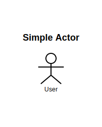
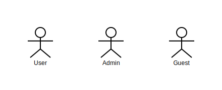
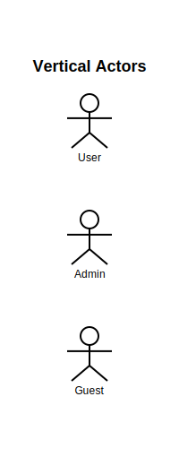
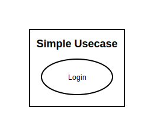
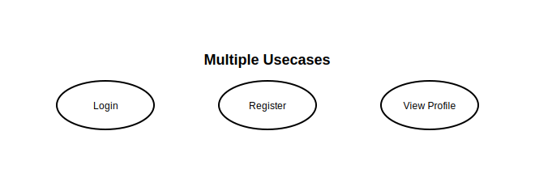
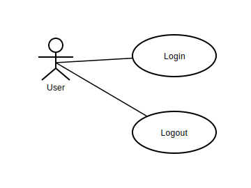
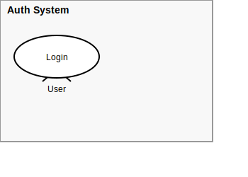
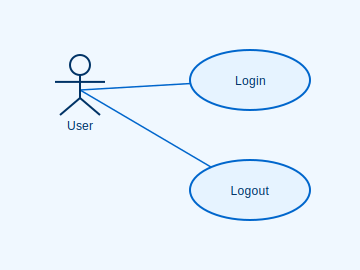
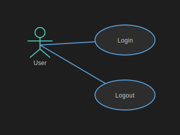

# Gallery

このページでは、Kiwumilで生成できる図の例を紹介します。

## Actor Examples

### Simple Actor

基本的なアクター要素の描画例。

**Code:**
```typescript
// example/actor_simple.ts
import { Diagram, UMLPlugin } from "../src/index"

Diagram
  .use(UMLPlugin)
  .build("Simple Actor", (element, relation, hint) => {
    element.actor("User")
  })
  .render("example/actor_simple.svg")
```

**Output:**



---

### Horizontal Layout

複数のアクターを水平に配置した例。

**Code:**
```typescript
// example/actor_horizontal.ts
import { Diagram, UMLPlugin } from "../src/index"

Diagram
  .use(UMLPlugin)
  .build("Horizontal Actors", (element, relation, hint) => {
    const user1 = element.actor("User")
    const user2 = element.actor("Admin")
    const user3 = element.actor("Guest")

    hint.arrangeHorizontal(user1, user2, user3)
  })
  .render("example/actor_horizontal.svg")
```

**Output:**



---

### Vertical Layout

複数のアクターを垂直に配置した例。

**Code:**
```typescript
// example/actor_vertical.ts
import { Diagram, UMLPlugin } from "../src/index"

Diagram
  .use(UMLPlugin)
  .build("Vertical Actors", (element, relation, hint) => {
    const user1 = element.actor("User")
    const user2 = element.actor("Admin")
    const user3 = element.actor("Guest")

    hint.arrangeVertical(user1, user2, user3)
  })
  .render("example/actor_vertical.svg")
```

**Output:**



---

## Usecase Examples

### Simple Usecase

基本的なユースケース要素の描画例。

**Code:**
```typescript
// example/usecase_simple.ts
import { Diagram, UMLPlugin } from "../src/index"

Diagram
  .use(UMLPlugin)
  .build("Simple Usecase", (element, relation, hint) => {
    element.usecase("Login")
  })
  .render("example/usecase_simple.svg")
```

**Output:**



---

### Multiple Usecases

複数のユースケースを配置した例。

**Code:**
```typescript
// example/usecase_multiple.ts
import { Diagram, UMLPlugin } from "../src/index"

Diagram
  .use(UMLPlugin)
  .build("Multiple Usecases", (element, relation, hint) => {
    const login = element.usecase("Login")
    const register = element.usecase("Register")
    const profile = element.usecase("View Profile")
    
    hint.arrangeHorizontal(login, register)
    hint.arrangeHorizontal(register, profile)
  })
  .render("example/usecase_multiple.svg")
```

**Output:**



---

## Association Examples

### Usecase with Actor

アクターとユースケースを関連線で接続した例。

**Code:**
```typescript
// example/usecase_with_actor.ts
import { Diagram, UMLPlugin } from "../src/index"

Diagram
  .use(UMLPlugin)
  .build("Usecase with Actor", (element, relation, hint) => {
    const user = element.actor("User")
    const login = element.usecase("Login")
    const logout = element.usecase("Logout")
    
    relation.associate(user, login)
    relation.associate(user, logout)
    
    hint.arrangeHorizontal(user, login)
    hint.arrangeVertical(login, logout)
  })
  .render("example/usecase_with_actor.svg")
```

**Output:**



---

## System Boundary Examples

### First Milestone - Complete Use Case Example ✅

複数のアクターとユースケース、システム境界を組み合わせた実用的な例。

**🎉 First Milestone 達成！** 新しい `arrangeVertical` API により、システム境界内の複数ユースケースが重ならずに配置されます。

**Code:**
```typescript
// example/first_milestone.ts
import { Diagram, UMLPlugin } from "../src/index"

Diagram
  .use(UMLPlugin)
  .build("First Milestone", (el, rel, hint) => {
    // 1. シンボルを定義
    const user = el.actor("User")
    const admin = el.actor("Admin")
    
    const login = el.usecase("Login")
    const logout = el.usecase("Logout")
    const manage_users = el.usecase("Manage Users")
    
    const system_boundary = el.systemBoundary("システム化範囲")
    
    // 2. 関係を定義
    rel.associate(user, login)
    rel.associate(user, logout)
    rel.associate(admin, login)
    rel.associate(admin, logout)
    rel.associate(admin, manage_users)
    
    // 3. レイアウトヒントを設定（新しいAPI）
    hint.arrangeVertical(user, admin)
    hint.arrangeHorizontal(user, system_boundary)
    hint.enclose(system_boundary, [login, logout, manage_users])
    hint.arrangeVertical(login, logout, manage_users)  // ✅ 重ならない！
  })
  .render("example/first_milestone.svg")
```

**Output:**


---

### System Boundary with Usecase

システム境界内にユースケースを配置した例。

**Code:**
```typescript
// example/system_boundary_example.ts
import { Diagram, UMLPlugin } from "../src/index"

Diagram
  .use(UMLPlugin)
  .build("System Boundary Example", (el, rel, hint) => {
    const user = el.actor("User")
    const login = el.usecase("Login")
    const boundary = el.systemBoundary("Auth System")

    hint.enclose(boundary, [login])
    hint.arrangeHorizontal(user, boundary)
    rel.associate(user, login)
  })
  .render("example/system_boundary_example.svg")
```

**Output:**



---

## Theme Examples

### Blue Theme

ブルーテーマを適用した例。

**Code:**
```typescript
// example/usecase_with_actor_blue.ts
import { Diagram, UMLPlugin, themes } from "../src/index"

Diagram
  .use(UMLPlugin)
  .theme(themes.blue)
  .build("Usecase with Actor (Blue Theme)", (element, relation, hint) => {
    const user = element.actor("User")
    const login = element.usecase("Login")
    const logout = element.usecase("Logout")
    
    relation.associate(user, login)
    relation.associate(user, logout)
    
    hint.arrangeHorizontal(user, login)
    hint.arrangeVertical(login, logout)
  })
  .render("example/usecase_with_actor_blue.svg")
```

**Output:**



---

### Dark Theme

ダークテーマを適用した例。

**Code:**
```typescript
// example/usecase_with_actor_dark.ts
import { Diagram, UMLPlugin, themes } from "../src/index"

Diagram
  .use(UMLPlugin)
  .theme(themes.dark)
  .build("Usecase with Actor (Dark Theme)", (element, relation, hint) => {
    const user = element.actor("User")
    const login = element.usecase("Login")
    const logout = element.usecase("Logout")
    
    relation.associate(user, login)
    relation.associate(user, logout)
    
    hint.arrangeHorizontal(user, login)
    hint.arrangeVertical(login, logout)
  })
  .render("example/usecase_with_actor_dark.svg")
```

**Output:**



---

## Contributing

新しい例を追加したい場合は、`example/`ディレクトリに新しいTypeScriptファイルを作成し、同名のSVGファイルを生成してください。
