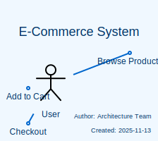
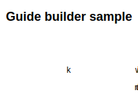
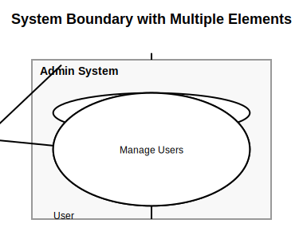
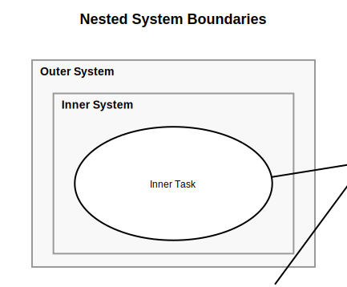
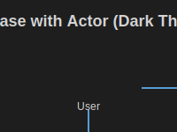

# Gallery

Kiwumil で作成できる図の例です。

## E-Commerce System (Diagram Info Full)

完全なメタデータ（タイトル、作成日、作成者）を含むダイアグラムの例。Blue Theme を使用。

[コード](./examples/diagram_info_full.ts)

---

## First Milestone

プロジェクトの最初のマイルストーンだったユースケース図。

[コード](./examples/first_milestone.ts)

---

## Grid of Arrange

arrangeHorizontal と arrangeVertical を組み合わせたレイアウト例。"kiwumil" の文字を2段組で配置。

[コード](./examples/kiwumil.ts)

---

## System Boundary with Multiple Elements

システム境界内に複数のユースケースを配置した例。

[コード](./examples/system_boundary_complex.ts)

---

## Nested System Boundaries

システム境界をネストして、階層的な構造を表現した例。

[コード](./examples/system_boundary_nested.ts)

---

## UML Relations Example

UMLの様々なリレーションシップ（関連、包含、拡張、汎化）を示す例。

[コード](./examples/uml-relations.ts)

---

## Usecase with Actor (Dark Theme)

Dark Theme を使用したアクターとユースケースの図。

[コード](./examples/usecase_with_actor_dark.ts)

