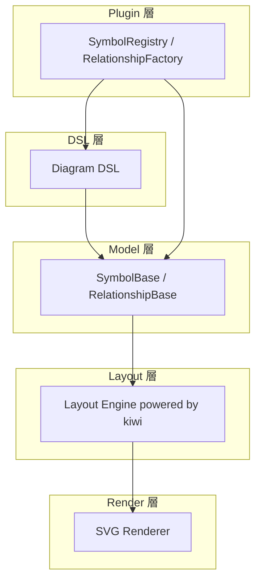

# 🥝 Kiwumil (キューミル)

**Kiwumil** は、[@lume/kiwi](https://github.com/lume/kiwi) 制約ソルバーを使って  
UML風の図を自動レイアウトするための TypeScript ライブラリです。  
PlantUML / Mermaid.js のような手軽さを保ちながら、  
より「制約に基づいた整列の美しさ」を目指しています。

---

## 🌱 コンセプト

PlantUML や Mermaid.js は強力ですが、自動レイアウトの機能は
嬉しい反面、納得できるきれいなダイアグラムが作成できませんでした。

Kiwumil はこれを **3つのステップ** で簡潔に表現できることを目指します：

1. **ノードを定義する**
2. **関係を定義する**
3. **レイアウトヒントを与える**

---

## 🧩 使用イメージ

```typescript
import { TypedDiagram, UMLPlugin } from "kiwumil"

// シンプルな使い方
TypedDiagram("First Milestone")
  .use(UMLPlugin)
  .build((el, rel, hint) => {
    // 1. シンボルを定義（名前空間ベースの DSL）
    const user = el.uml.actor("User")
    const admin = el.uml.actor("Admin")
    
    const login = el.uml.usecase("Login")
    const logout = el.uml.usecase("Logout")
    const manage_users = el.uml.usecase("Manage Users")
    
    const system_boundary = el.uml.systemBoundary("システム化範囲")
    
    // 2. 関係を定義
    rel.uml.associate(user, login)
    rel.uml.associate(user, logout)
    rel.uml.associate(admin, login)
    rel.uml.associate(admin, logout)
    rel.uml.associate(admin, manage_users)
    
    // 3. レイアウトヒントを設定
    hint.arrangeVertical(user, admin)
    hint.arrangeHorizontal(user, system_boundary)
    hint.enclose(system_boundary, [login, logout, manage_users])
    hint.arrangeVertical(login, logout, manage_users)
  })
  .render("output.svg")

// メタデータ付きの図も作成可能
TypedDiagram({
  title: "E-Commerce System",
  createdAt: "2025-11-14",
  author: "Architecture Team"
})
  .use(UMLPlugin)
  .build((el, rel, hint) => {
    // ...
  })
  .render("output.svg")
```

**出力イメージ:**


**特徴:**
- 🎨 **テーマシステム** - default, blue, dark の3つのプリセットテーマ
- 🔧 **制約ベースレイアウト** - Cassowary アルゴリズムによる自動整列
- 📦 **自動サイズ調整コンテナ** - SystemBoundary が内容物に合わせて自動拡大
- 🔌 **プラグインシステム** - 名前空間ベースでカスタムシンボルを自由に追加可能
- ✨ **Arrange + Align API** - 直感的なレイアウト記述
- 📝 **メタデータサポート** - タイトル、作成日、著者を図に含められる
- 🎯 **型安全な DSL** - TypeScript の型推論による IntelliSense サポート

**🎉 New!** 
- **名前空間ベースの DSL** - `el.uml.actor()`, `el.core.circle()` のように、プラグインごとの名前空間でシンボルを作成
- **ID 管理の改善** - すべてのシンボルと関係に一意な ID が付与される（例: `uml:actor-0`, `uml:association-0`）
- **強力な型安全性** - プラグインの型が自動的に推論され、存在しないメソッドを呼ぶとコンパイルエラー

詳細は [docs/design/layout-system.md](docs/design/layout-system.md) を参照してください。

---

## 📚 ドキュメント

- **[Namespace-based DSL](docs/design/namespace-dsl.md)** - DSL設計とAPI使い方
- **[Plugin System](docs/design/plugin-system.md)** - プラグイン作成ガイド
- **[Layout System](docs/design/layout-system.md)** - レイアウトエンジンの設計
- **[Theme System](docs/design/theme-system.md)** - テーマシステムの仕様
- **[Git Workflow](docs/design/git-workflow.md)** - 開発ワークフロー

---

## 🎨 テーマシステム

Kiwumil はプリセットテーマをインポートして適用できます：

```typescript
import { TypedDiagram, UMLPlugin, BlueTheme, DarkTheme } from "kiwumil"

// Blue テーマを適用
TypedDiagram("Login System")
  .use(UMLPlugin)
  .theme(BlueTheme)
  .build((el, rel, hint) => {
    const user = el.uml.actor("User")
    const login = el.uml.usecase("Login")
    rel.uml.associate(user, login)
    hint.arrangeHorizontal(user, login)
  })
  .render("output_blue.svg")

// Dark テーマを適用
TypedDiagram("Login System")
  .use(UMLPlugin)
  .theme(DarkTheme)
  .build((el, rel, hint) => {
    const user = el.uml.actor("User")
    const login = el.uml.usecase("Login")
    rel.uml.associate(user, login)
    hint.arrangeHorizontal(user, login)
  })
  .render("output_dark.svg")
```

**利用可能なテーマ:**
- `DefaultTheme` - デフォルトの白基調
- `BlueTheme` - 青基調のテーマ
- `DarkTheme` - ダークモードテーマ

---

## 🧠 技術スタック

| 要素       | 内容                                                        |
| -------    | ----------------------------------------------------------- |
| 言語       | TypeScript                                                  |
| 実行環境   | [Bun](https://bun.sh)                                       |
| 制約ソルバ | [@lume/kiwi](https://github.com/lume/kiwi)（Cassowaryアルゴリズム） |
| 目的       | UML図などの自動レイアウトエンジンの構築                     |

---




* DSL: actor, usecase の呼び出しを SymbolRegistry から解決
* Model: SymbolBase / RelationshipBase のインスタンスを構築
* Layout: Cassowary 制約で位置を自動計算
* Render: SvgRenderer により描画（矢印は折れ線）
* Plugin: ユーザ追加のシンボル・関係も透過的に統合

---

## 📁 プロジェクト構造

```
kiwumil/
├── src/
│   ├── dsl/                          # DSL・プラグインシステム層
│   │   ├── diagram.ts                # Diagramクラス（エントリポイント）
│   │   ├── diagram_builder.ts        # Diagram構築ビルダー
│   │   ├── plugin_manager.ts         # Plugin管理・登録
│   │   ├── element_factory.ts        # SymbolRegistryをProxyでラップ
│   │   ├── relationship_factory.ts   # Relationship生成
│   │   └── hint_factory.ts           # hint.horizontal/verticalなどのDSL補助
│   │
│   ├── model/                        # モデル層（UML構造定義）
│   │   ├── symbol_base.ts            # Symbol基底クラス
│   │   ├── symbol_registry.ts        # Symbol型の登録・生成
│   │   ├── relationship_registry.ts  # Relationship型の登録・生成
│   │   └── types.ts                  # 共通型定義（座標・サイズ・IDなど）
│   │
│   ├── layout/                       # レイアウト層（Cassowary等）
│   │   └── layout_solver.ts          # Cassowary制約ソルバーラッパ
│   │
│   ├── render/                       # レンダリング層（SVGなど）
│   │   └── svg_renderer.ts           # SVG出力メインレンダラー
│   │
│   ├── core/                         # 共通インフラ・ユーティリティ
│   │   ├── layout_engine.ts          # レイアウト計算メインエンジン
│   │   └── theme.ts                  # テーマ定義（色・線幅などのスタイル）
│   │
│   ├── plugin/                       # 組み込み・外部プラグイン郡
│   │   ├── core/                     # コア図形プラグイン
│   │   │   ├── index.ts              # CorePlugin定義
│   │   │   └── symbols/              # 基本図形シンボル群
│   │   │       ├── circle_symbol.ts
│   │   │       ├── ellipse_symbol.ts
│   │   │       ├── rectangle_symbol.ts
│   │   │       └── rounded_rectangle_symbol.ts
│   │   │
│   │   └── uml/                      # UMLプラグイン
│   │       ├── index.ts              # UMLPlugin定義
│   │       ├── symbols/              # UMLシンボル群
│   │       │   ├── actor_symbol.ts
│   │       │   ├── usecase_symbol.ts
│   │       │   └── system_boundary_symbol.ts
│   │       └── relationships/        # UML関係線群
│   │           └── association.ts
│   │
│   ├── utils/                        # ユーティリティ（現在空）
│   └── index.ts                      # エントリポイント (各種エクスポート)
│
├── example/                          # 各種実行例
│   ├── first_milestone.ts            # 基本のユースケース図
│   ├── actor_simple.ts               # シンプルなアクター図
│   ├── usecase_with_actor.ts         # アクター付きユースケース図
│   ├── system_boundary_*.ts          # SystemBoundary各種例
│   ├── theme_example.ts              # テーマシステム利用例
│   ├── basic_shapes.ts               # 基本図形利用例
│   └── *.svg                         # 各tsファイルの出力SVG
│
├── tests/                            # テストファイル群
│   ├── diagram_builder.test.ts
│   ├── layout_solver.test.ts
│   └── theme.test.ts
│
├── index.ts                          # プロジェクトルートのエントリポイント
├── package.json
├── tsconfig.json
├── docs/                          # ドキュメント
│   └── design/                    # 設計ドキュメント
│       ├── namespace-dsl.md       # 名前空間ベースDSL設計とAPI
│       ├── plugin-system.md       # プラグイン作成ガイド
│       ├── layout-system.md       # レイアウトシステム設計
│       ├── theme-system.md        # テーマシステム設計
│       └── git-workflow.md        # Git ワークフロー
├── GALLERY.md                     # スクリーンショット集
└── README.md

```

---

## ⚙️ セットアップ

```bash
bun init
bun add @lume/kiwi
```

## 🚧 今後の予定

* [x] `LayoutHint` クラスによる宣言的API (`hint.horizontal()`, `hint.vertical()`)
* [x] SVG レンダラー
* [x] テーマシステム (default, blue, dark)
* [x] `SystemBoundary` によるコンテナ制約 (`hint.enclose()`)
* [x] Z-Index ベースのレンダリング（ネスト構造対応）
* [ ] Include / Extend 関係（ユースケース図）
* [ ] Generalization 関係（継承矢印）
* [ ] Note シンボル（注釈）
* [ ] 矢印・関係線の自動ルーティング
* [ ] クラス図対応（Class, Interface, Package）
* [ ] Canvas レンダラー
* [ ] PlantUML / Mermaid.js 風 DSL の追加
* [ ] Webアプリデモ

---

## 🗣️ 名前について

> **Kiwumil (キューミル)** は
> “KiwiでUMLを書く” → “Kiw(um)i(l)”
> という語呂合わせから生まれた名前です 🍃


英語的には “キューミル” /ˈkɪ.wu.mɪl/ に近い発音になります。
Kiwi（制約ソルバ）と UML（構造表現）を融合した、
軽量で宣言的なレイアウトエンジンを目指します。

---

## 🧾 ライセンス

MIT License
(c) 2025 Kousuke Taniguchi

---

## ✨ スクリーンショット

[GALLERY.md](GALLERY.md)
