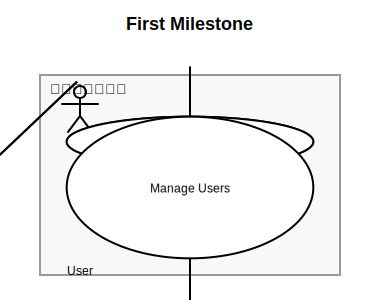

# 🥝 Kiwumil (キューミル)

**Kiwumil** は、[@lume/kiwi](https://github.com/lume/kiwi) 制約ソルバーを使って  
UML風の図をテキストで記述しつつ、必要な部分だけ制約で整えるための TypeScript ライブラリです。  
PlantUML / Mermaid.js のような手軽さをリスペクトしながら、  
「手で配置したいこだわり」と「制約による整列」を両立させることを目指しています。

---

## 🌱 コンセプト

PlantUML や Mermaid.js が「テキストで図を書く」体験を切り開いてくれたことに感謝しています。  
一方で、レイアウトを完全に自動に任せると細部が思い通りにならず、  
かといってベクターエディタへ移行するとテキスト編集の快適さを失ってしまいます。

Kiwumil は、このギャップを埋めるために **3つのステップ** へ集約しました：

1. **ノードを定義する**
2. **関係を定義する**
3. **レイアウトヒントを与える**

---

## 🧩 使用イメージ

```typescript
import { TypeDiagram, UMLPlugin } from "kiwumil"

// シンプルな使い方
TypeDiagram("First Milestone")
  .use(UMLPlugin)
  .layout(({ el, rel, hint }) => {
    // 1. シンボルを定義（名前空間ベースの DSL）
    const user = el.uml.actor("User")
    const admin = el.uml.actor("Admin")

    const login = el.uml.usecase("Login")
    const logout = el.uml.usecase("Logout")
    const manage_users = el.uml.usecase("Manage Users")

    const system_boundary = el.uml.systemBoundary("システム化範囲")

    // 2. 関係を定義
    rel.uml.associate(user, login)
    rel.uml.associate(user, logout)
    rel.uml.associate(admin, login)
    rel.uml.associate(admin, logout)
    rel.uml.associate(admin, manage_users)

    // 3. レイアウトヒントを設定
    hint.arrangeVertical(user, admin)
    hint.arrangeHorizontal(user, system_boundary)
    hint.enclose(system_boundary, [login, logout, manage_users])
    hint.arrangeVertical(login, logout, manage_users)
  })
  .render("output.svg")
```

**出力イメージ:**



**特徴:**

- 🔧 **制約 + レイアウトヒント** - Cassowary 制約ソルバーをベースに、`hint.arrange*` / `hint.enclose` で意図した整列を記述
- 📦 **自動サイズ調整コンテナ** - SystemBoundary などが子要素に合わせてスケールし、ラベルで囲みを作成
- 🔌 **名前空間プラグイン** - `el.uml.actor()` のようにプラグインごとに DSL が分離され、カスタム図形も拡張可能
- 📐 **Guide ベースの整列** - `hint.createGuideX/Y()` でガイドラインを作り、複数シンボルを同一ラインに寄せられる
- 📝 **メタデータサポート** - タイトルや作成日を図に添えてアーカイブできる
- 🎯 **型安全な DSL** - `tsd` テストで守られた型推論により、存在しないメソッド呼び出しをコンパイル前に検知
- 🧵 **SuggestHandle** - `KiwiSolver.createHandle()` から強度文字列（`strong`/`medium`/`weak`）を選び、`kiwi` を隠蔽したまま編集変数を操作

プラグインは Symbol/Relationship を提供するだけでなく、Namespace DSL と直結します。`TypeDiagram().use(MyPlugin)` と書くだけで `el.myplugin.*` / `rel.myplugin.*` が補完され、独自の図形や関係線をコアの API と同じ手触りで扱えるため、ドメイン特化の作図体験をシームレスに拡張できます。

詳細は [docs/design/layout-hints.md](docs/design/layout-hints.md) を参照してください。

---

## 📚 ドキュメント

- **[Namespace-based DSL](docs/design/namespace-dsl.md)** - DSL設計とAPI使い方
- **[Plugin System](docs/design/plugin-system.md)** - プラグイン作成ガイド
- **[Layout Hints API](docs/design/layout-hints.md)** - レイアウトヒントAPIの使い方（ユーザー向け）
- **[Layout DSL Vocabulary](docs/design/layout_dsl.md)** - DSL語彙とビルダーインターフェースの詳細仕様
- **[Layout System](docs/design/layout-system.md)** - レイアウトエンジンの内部実装（開発者向け）
- **[Theme System](docs/design/theme-system.md)** - テーマシステムの設計
- **[Web Rendering](docs/design/web-rendering.md)** - ブラウザ環境でのレンダリング
- **[Git Workflow](docs/design/git-workflow.md)** - 開発ワークフロー

---

## 📦 インストール

**`@tinsep19/kiwumil`** は GitHub Packages で公開されています。  
インストールには GitHub の Personal Access Token（read-only）が必要です。

### トークンを発行する

GitHub → Settings → Developer settings → Personal access tokens → Tokens (classic)  
→ **Generate new token (classic)**

スコープは **`read:packages`** のみでOK 🔑

### `.npmrc` を設定する

ホームディレクトリに `.npmrc` を作成：

```bash
@tinsep19:registry=https://npm.pkg.github.com/
//npm.pkg.github.com/:_authToken=YOUR_READONLY_PAT
```

⚠ `YOUR_READONLY_PAT` は発行したトークンに置き換えてください

### インストール

```bash
bun install @tinsep19/kiwumil
```

---

## 🧠 技術スタック

| 要素       | 内容                                                                |
| ---------- | ------------------------------------------------------------------- |
| 言語       | TypeScript                                                          |
| 実行環境   | [Bun](https://bun.sh)                                               |
| 制約ソルバ | [@lume/kiwi](https://github.com/lume/kiwi)（Cassowaryアルゴリズム） |
| 目的       | テキスト定義 + 制約ヒントで整える図レイアウトエンジン               |

---


- DSL: actor, usecase の呼び出しを SymbolRegistry から解決
- Model: SymbolBase / RelationshipBase のインスタンスを構築
- Kiwi: Cassowary 制約で位置を自動計算
- Kiwi: `KiwiSolver` の `SuggestHandle` を通じてストレングスを文字列で扱い、`kiwi.Solver` との直接依存を封じた edit-variable 管理
- Render: SvgRenderer により描画（矢印は折れ線）
- Plugin: ユーザ追加のシンボル・関係も透過的に統合

---

## 📁 プロジェクト構造

```
kiwumil/
├── src/
│   ├── core/                      # 制約計算の基盤（テーマやエンジン）
│   │   ├── layout_engine.ts
│   │   └── theme.ts
│   ├── dsl/                       # TypeDiagram / ヒント / プラグインIF
│   │   ├── diagram_builder.ts
│   │   ├── diagram_plugin.ts
│   │   ├── hint_factory.ts
│   │   ├── id_generator.ts
│   │   ├── namespace_builder.ts
│   │   └── namespace_types.ts
│   ├── kiwi/                      # Cassowary 連携
│   │   ├── layout_solver.ts
│   │   └── constraints_builder.ts
│   ├── model/                     # Symbol / Relationship の共通クラス
│   │   ├── diagram_info.ts
│   │   ├── diagram_symbol.ts
│   │   ├── relationship_base.ts
│   │   ├── symbol_base.ts
│   │   └── types.ts
│   ├── plugin/
│   │   ├── core/
│   │   │   ├── plugin.ts
│   │   │   └── symbols/
│   │   │       ├── circle_symbol.ts
│   │   │       ├── ellipse_symbol.ts
│   │   │       ├── rectangle_symbol.ts
│   │   │       ├── rounded_rectangle_symbol.ts
│   │   │       └── text_symbol.ts
│   │   └── uml/
│   │       ├── plugin.ts
│   │       ├── relationships/
│   │       │   ├── association.ts
│   │       │   ├── extend.ts
│   │       │   ├── generalize.ts
│   │       │   └── include.ts
│   │       └── symbols/
│   │           ├── actor_symbol.ts
│   │           ├── system_boundary_symbol.ts
│   │           └── usecase_symbol.ts
│   ├── render/
│   │   └── svg_renderer.ts
│   ├── utils/
│   │   └── path_helper.ts
│   └── index.ts                   # ライブラリの公開エントリポイント
│
├── example/                       # CLI から動かせるサンプル
│   ├── core_text_poc.ts
│   ├── diagram_info_full.ts
│   ├── first_milestone.ts
│   ├── system_boundary_complex.ts
│   ├── uml-relations.ts
│   └── usecase_with_actor_dark.ts
│
├── tests/                         # Bun test
│   ├── layout_solver.test.ts
│   ├── namespace_dsl.test.ts
│   └── ...
├── tsd/                           # 型テスト (`bun run test:types`)
│
├── docs/
│   ├── design/
│   │   ├── git-workflow.md
│   │   ├── layout-hints.md
│   │   ├── layout-system.md
│   │   ├── namespace-dsl.md
│   │   ├── plugin-system.md
│   │   ├── theme-system.md
│   │   └── web-rendering.md
│   └── devlog/
├── scripts/
├── package.json
├── tsconfig.json
└── README.md

```

---

## ⚙️ セットアップ

```bash
bun init
bun add @lume/kiwi
```

## 🚧 今後の予定

- [x] `LayoutHint` クラスによる宣言的API (`hint.horizontal()`, `hint.vertical()`)
- [x] SVG レンダラー
- [x] テーマシステム (default, blue, dark)
- [x] `SystemBoundary` によるコンテナ制約 (`hint.enclose()`)
- [x] Z-Index ベースのレンダリング（ネスト構造対応）
- [x] Include / Extend 関係（ユースケース図）
- [x] Generalization 関係（継承矢印）
- [ ] Note シンボル（注釈）
- [ ] 矢印・関係線の自動ルーティング
- [ ] クラス図対応（Class, Interface, Package）
- [ ] Canvas レンダラー
- [ ] PlantUML / Mermaid.js 風 DSL の追加
- [ ] Webアプリデモ

---

## 🗣️ 名前について

> **Kiwumil (キューミル)** は
> “KiwiでUMLを書く” → “Kiw(um)i(l)”
> という語呂合わせから生まれた名前です 🍃

英語的には “キューミル” /ˈkɪ.wu.mɪl/ に近い発音になります。
Kiwi（制約ソルバ）と UML（構造表現）を融合した、
軽量で宣言的なレイアウトエンジンを目指します。

---

## 🤝 貢献について (CONTRIBUTION)

現在のところ外部からの貢献は受け付けていません。プロジェクトの API はまだ不安定で、1.0.0 に到達するまでは破壊的な変更や流動的な改定を行う予定です。そのため、バージョン 1.0.0 をリリースするまではコントリビューションの受付を控えます。

1.0.0 リリース時には CONTRIBUTING.md を追加し、ブランチ/PR の運用ルール、コードスタイル、テスト要件などを明記した上で外部からの貢献を受け入れる予定です。

バグ報告や要望、アイデアがある場合は Issue を立ててください。今後の改善の参考とさせていただきますが、初期段階のため対応に時間がかかることがあります。

---

## 🛠️ 開発ガイド

### アーキテクチャと循環依存防止

プロジェクトは循環依存を防止するためのレイヤーベース設計を採用しています：

```
Layer 4: DSL/UI     (dsl/, render/)
Layer 3: Plugins    (plugin/)  
Layer 2: Model      (model/, hint/)
Layer 1: Core       (core/, kiwi/, theme/, icon/, utils/)
```

詳細は [循環依存防止ガイドライン](docs/guidelines/circular-dependency-prevention.md) をご覧ください。

### テスト実行

```bash
bun run test        # テスト実行
bun run lint        # リント実行
bun run test:types  # 型定義テスト
```

### ドキュメント

- [設計ドキュメント](docs/design/) - アーキテクチャと設計思想
- [開発ログ](docs/devlog/) - 実装の経緯と技術的判断
- [ガイドライン](docs/guidelines/) - 開発ルールとベストプラクティス

---

## 🧾 ライセンス

MIT License
(c) 2025 Kousuke Taniguchi

---

## ✨ スクリーンショット

[GALLERY.md](GALLERY.md)
