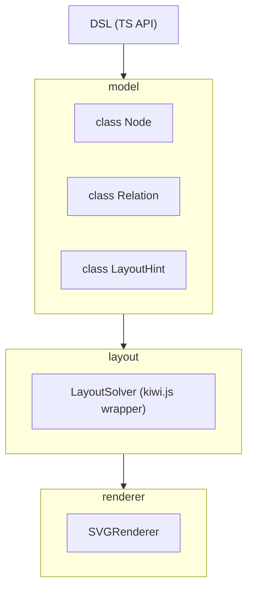

# 🥝 Kiwumil (キウミル)

**Kiwumil** は、[@lume/kiwi](https://github.com/lume/kiwi) 制約ソルバーを使って  
UML風の図を自動レイアウトするための TypeScript ライブラリです。  
PlantUML / Mermaid.js のような手軽さを保ちながら、  
より「制約に基づいた整列の美しさ」を目指しています。

---

## 🌱 コンセプト

PlantUML や Mermaid.js は強力ですが、次のような不満がありました：

- ノードを「同じ軸に並べたい」だけなのにオプションが多すぎる  
- 矢印を自然に揃えるのが難しい  
- システム境界などの矩形をきれいに扱いたい  

Kiwumil はこれを **3つのステップ** で簡潔に表現できることを目指します：

1. **ノードを定義する**
2. **関係を定義する**
3. **レイアウトヒントを与える**

---

## 🧩 使用イメージ

```ts
// (今後 DSL化予定)
// 例: ユースケース図のような構造

const a_actor = Actor.new("User")
const a_uc = UseCase.new("Login")
const system_boundary = Container.new("System")

Relation.use(a_actor, a_uc)
system_boundary.push(a_uc)

const y_hint = LayoutHint.horizontal()
y_hint.push(a_actor, a_uc)

Diagram.render([a_actor, a_uc, system_boundary], y_hint)
```

このような宣言的な構文で、
アクターとユースケースが同じ高さで左から右に並び、
システム境界内に配置された図を生成することを目指します。

---

## 🧠 技術スタック

| 要素       | 内容                                                        |
| -------    | ----------------------------------------------------------- |
| 言語       | TypeScript                                                  |
| 実行環境   | [Bun](https://bun.sh)                                       |
| 制約ソルバ | [@lume/kiwi](https://github.com/lume/kiwi)（Cassowaryアルゴリズム） |
| 目的       | UML図などの自動レイアウトエンジンの構築                     |

---




* model — Actor, UseCase, Containerなどの定義
* layout — LayoutHintをkiwi.js制約に変換して座標を求める
* renderer — 結果をSVGに描画

---

## 📁 プロジェクト構造

```
kiumlwi/
├─ bunfig.toml
├─ package.json
├─ src/
│  ├─ core/
│  │  └─ layout_engine.ts     # kiwi を使った制約レイアウトロジック
│  └─ render/
│     └─ svg_renderer.ts      # (今後) SVG描画用
└─ examples/
   ├─ horizontal_usecase.ts        # 水平レイアウトの例
   └─ vertical_layout.ts       # 垂直レイアウトの例
```

---

## ⚙️ セットアップ

```bash
bun init
bun add @lume/kiwi
```

---

## 💻 最小のレイアウト例

```ts
import { LayoutEngine } from "./src/core/layout_engine.ts"

const engine = new LayoutEngine()

const a = engine.addNode("a")
const b = engine.addNode("b")
const c = engine.addNode("c")

engine.anchorNode(a, 0, 0)
engine.addHorizontalLayout([a, b, c], 50)

const result = engine.solve()
console.log(result)
```

出力：

```json
{
  "a": { "x": 0, "y": 0, "w": 100, "h": 60 },
  "b": { "x": 150, "y": 0, "w": 100, "h": 60 },
  "c": { "x": 300, "y": 0, "w": 100, "h": 60 }
}
```

---

## 🧭 実装済みのレイアウト機能

| 機能                      | 説明            |
| ----------------------- | ------------- |
| `addHorizontalLayout()` | ノードを左から右に並べる  |
| `addVerticalLayout()`   | ノードを上から下に並べる  |
| `anchorNode()`          | ノードの原点を固定する   |
| `solve()`               | 制約を解いて座標を出力する |

---

## 🚧 今後の予定

* [ ] `LayoutHint` クラスによる宣言的API (`LayoutHint.horizontal(a, b, c)`)
* [ ] `Container` による矩形グループ制約
* [ ] 矢印・関係線の自動ルーティング
* [ ] SVG / Canvas レンダラー
* [ ] PlantUML / Mermaid.js 風 DSL の追加
* [ ] Webアプリデモ

---

## 🗣️ 名前について

> **Kiwumil (キウミル)** は
> “KiwiでUMLを書く” → “Kiw(um)i(l)”
> という語呂合わせから生まれた名前です 🍃


英語的には “キューミル” /ˈkɪ.wu.mɪl/ に近い発音になります。
Kiwi（制約ソルバ）と UML（構造表現）を融合した、
軽量で宣言的なレイアウトエンジンを目指します。

---

## 🧾 ライセンス

MIT License
(c) 2025 Kousuke Taniguchi

---

## ✨ スクリーンショット（予定）

（ロゴ / サンプル図などをここに掲載予定）

