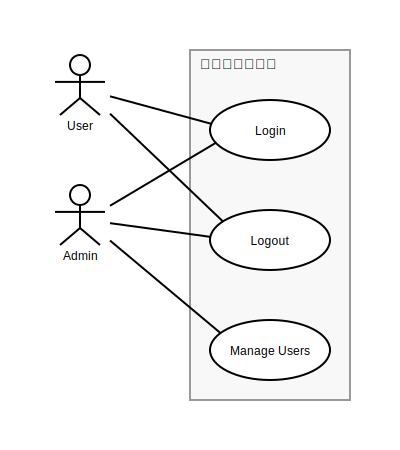
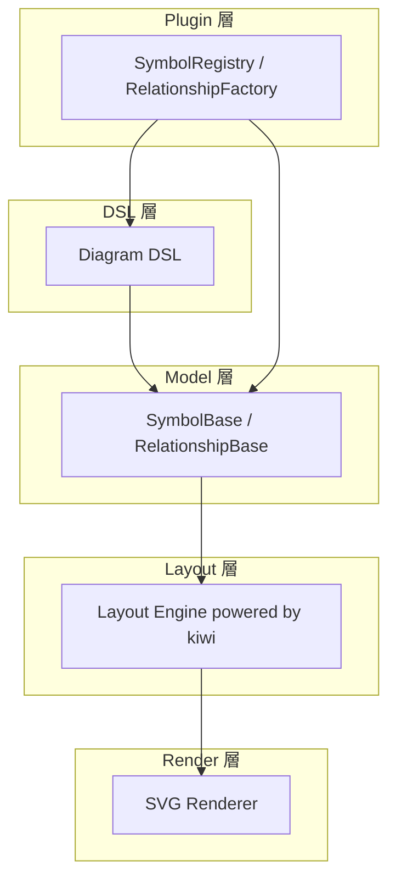

# 🥝 Kiwumil (キウミル)

**Kiwumil** は、[@lume/kiwi](https://github.com/lume/kiwi) 制約ソルバーを使って  
UML風の図を自動レイアウトするための TypeScript ライブラリです。  
PlantUML / Mermaid.js のような手軽さを保ちながら、  
より「制約に基づいた整列の美しさ」を目指しています。

---

## 🌱 コンセプト

PlantUML や Mermaid.js は強力ですが、次のような不満がありました：

- ノードを「同じ軸に並べたい」だけなのにオプションが多すぎる  
- 矢印を自然に揃えるのが難しい  
- システム境界などの矩形をきれいに扱いたい  

Kiwumil はこれを **3つのステップ** で簡潔に表現できることを目指します：

1. **ノードを定義する**
2. **関係を定義する**
3. **レイアウトヒントを与える**

---

## 🧩 使用イメージ

```typescript
import { Diagram, CorePlugin } from "kiwumil"

Diagram
  .use(CorePlugin)
  .build("First Milestone", (el, rel, hint) => {
    // 1. シンボルを定義
    const user = el.actor("User")
    const admin = el.actor("Admin")
    
    const login = el.usecase("Login")
    const logout = el.usecase("Logout")
    const manage_users = el.usecase("Manage Users")
    
    const system_boundary = el.systemBoundary("システム化範囲")
    
    // 2. 関係を定義
    rel.associate(user, login)
    rel.associate(user, logout)
    rel.associate(admin, login)
    rel.associate(admin, logout)
    rel.associate(admin, manage_users)
    
    // 3. レイアウトヒントを設定
    hint.arrangeVertical(user, admin)
    hint.arrangeHorizontal(user, system_boundary)
    hint.pack(system_boundary, [login, logout, manage_users])
    hint.arrangeVertical(login, logout, manage_users)  // ✅ 重ならない！
  })
  .render("output.svg")
```

**出力イメージ:**



**特徴:**
- 🎨 **テーマシステム** - default, blue, dark の3つのプリセットテーマ
- 📦 **自動サイズ調整コンテナ** - SystemBoundary が内容物に合わせて自動拡大
- 🔧 **制約ベースレイアウト** - Cassowary アルゴリズムによる自動整列
- 🔌 **プラグインシステム** - カスタムシンボルを自由に追加可能
- ✨ **Arrange + Align API** - 直感的なレイアウト記述

**🎉 New!** Pack内要素の自動配置をサポート。`hint.arrangeVertical()` と組み合わせることで、要素が重ならずに配置されます。

詳細は [LAYOUT_DESIGN.md](LAYOUT_DESIGN.md) を参照してください。

---

## 🧠 技術スタック

| 要素       | 内容                                                        |
| -------    | ----------------------------------------------------------- |
| 言語       | TypeScript                                                  |
| 実行環境   | [Bun](https://bun.sh)                                       |
| 制約ソルバ | [@lume/kiwi](https://github.com/lume/kiwi)（Cassowaryアルゴリズム） |
| 目的       | UML図などの自動レイアウトエンジンの構築                     |

---




* DSL: actor, usecase の呼び出しを SymbolRegistry から解決
* Model: SymbolBase / RelationshipBase のインスタンスを構築
* Layout: Cassowary 制約で位置を自動計算
* Render: SvgRenderer により描画（矢印は折れ線）
* Plugin: ユーザ追加のシンボル・関係も透過的に統合

---

## 📁 プロジェクト構造

```
kiwumil/
├── src/
│   ├── dsl/                         # DSL・プラグインシステム層
│   │   ├── diagram.ts               # Diagramクラス（エントリポイント）
│   │   ├── plugin_manager.ts        # Plugin管理・登録
│   │   ├── element_factory.ts       # SymbolRegistryをProxyでラップ
│   │   ├── relationship_factory.ts  # Relationship生成
│   │   └── hint_factory.ts          # hint.horizontal/verticalなどのDSL補助
│   │
│   ├── model/                       # モデル層（UML構造定義）
│   │   ├── symbol_base.ts           # Symbol基底クラス
│   │   ├── symbol_registry.ts       # Symbol型の登録・生成
│   │   ├── relationship_base.ts     # 関係の基底クラス
│   │   ├── relationship_registry.ts # 関係の基底クラス
│   │   └── types.ts                 # 共通型定義（座標・サイズ・IDなど）
│   │
│   ├── layout/                      # レイアウト層（Cassowary等）
│   │   ├── layout_engine.ts         # レイアウト計算メイン
│   │   ├── constraint_solver.ts     # Cassowaryラッパ
│   │   └── layout_types.ts          # 位置・制約型定義
│   │
│   ├── render/                      # レンダリング層（SVGなど）
│   │   ├── svg_renderer.ts          # SVG出力
│   │   ├── svg_utils.ts             # SVG組み立て用ヘルパ
│   │   └── theme.ts                 # 色・線幅などのスタイル定義
│   │
│   ├── plugin/                      # 組み込み・外部プラグイン郡
│   │   ├── core_plugin.ts           # actor/usecase/classなどUML基本シンボル
│   │   └── ...                      # その他の拡張プラグイン
│   │
│   ├── core/                        # 共通インフラ・ユーティリティ
│   │   ├── id_generator.ts          # シンボルID管理
│   │   ├── error.ts                 # 共通例外
│   │   ├── logger.ts                # デバッグ出力
│   │   └── utils.ts                 # 共通関数
│   │
│   ├── index.ts                     # エントリポイント (Diagramエクスポート)
│   └── types.d.ts                   # 外部型定義補助（Plugin APIなど）
│
├── examples/
│   ├── usecase-basic.ts             # 基本のユースケース図
│   ├── use-with-plugin.ts           # プラグイン例（componentなど）
│   └── sequence.ts                  # 将来的な拡張例
│
├── tests/
│   ├── plugin.test.ts
│   ├── symbol_registry.test.ts
│   ├── render_svg.test.ts
│   └── layout_engine.test.ts
│
├── package.json
├── tsconfig.json
└── README.md

```

---

## ⚙️ セットアップ

```bash
bun init
bun add @lume/kiwi
```

## 🚧 今後の予定

* [x] `LayoutHint` クラスによる宣言的API (`hint.horizontal()`, `hint.vertical()`)
* [x] SVG レンダラー
* [x] テーマシステム (default, blue, dark)
* [x] `SystemBoundary` によるコンテナ制約 (`hint.pack()`)
* [x] Z-Index ベースのレンダリング（ネスト構造対応）
* [ ] Include / Extend 関係（ユースケース図）
* [ ] Generalization 関係（継承矢印）
* [ ] Note シンボル（注釈）
* [ ] 矢印・関係線の自動ルーティング
* [ ] クラス図対応（Class, Interface, Package）
* [ ] Canvas レンダラー
* [ ] PlantUML / Mermaid.js 風 DSL の追加
* [ ] Webアプリデモ

---

## 🗣️ 名前について

> **Kiwumil (キウミル)** は
> “KiwiでUMLを書く” → “Kiw(um)i(l)”
> という語呂合わせから生まれた名前です 🍃


英語的には “キューミル” /ˈkɪ.wu.mɪl/ に近い発音になります。
Kiwi（制約ソルバ）と UML（構造表現）を融合した、
軽量で宣言的なレイアウトエンジンを目指します。

---

## 🧾 ライセンス

MIT License
(c) 2025 Kousuke Taniguchi

---

## ✨ スクリーンショット（予定）

（ロゴ / サンプル図などをここに掲載予定）

